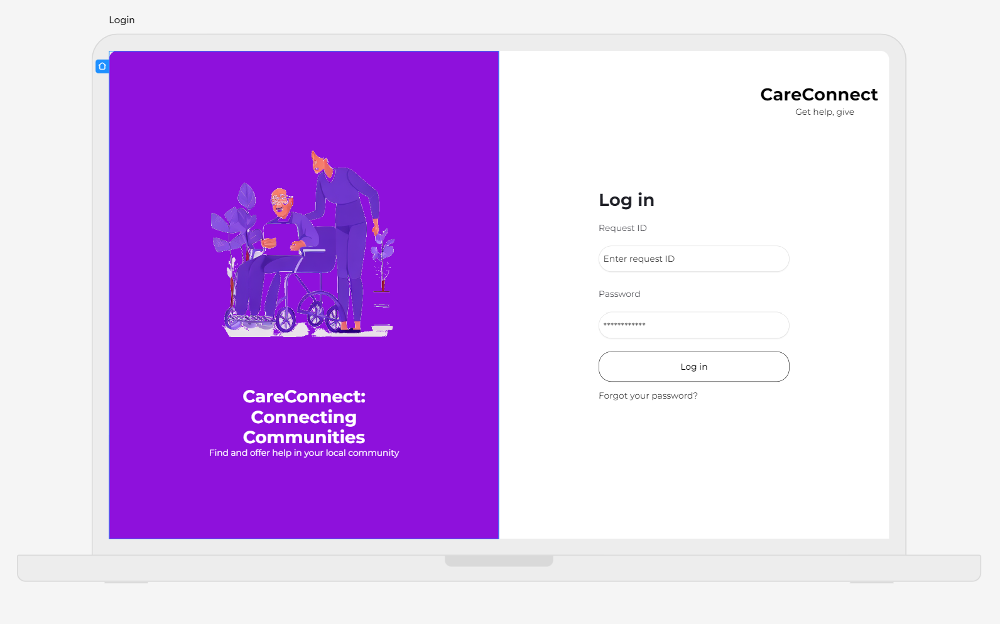
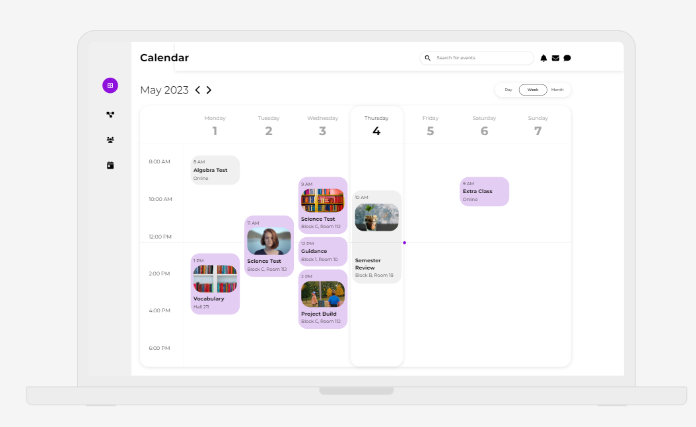
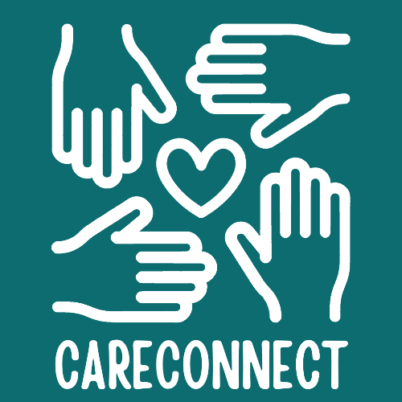
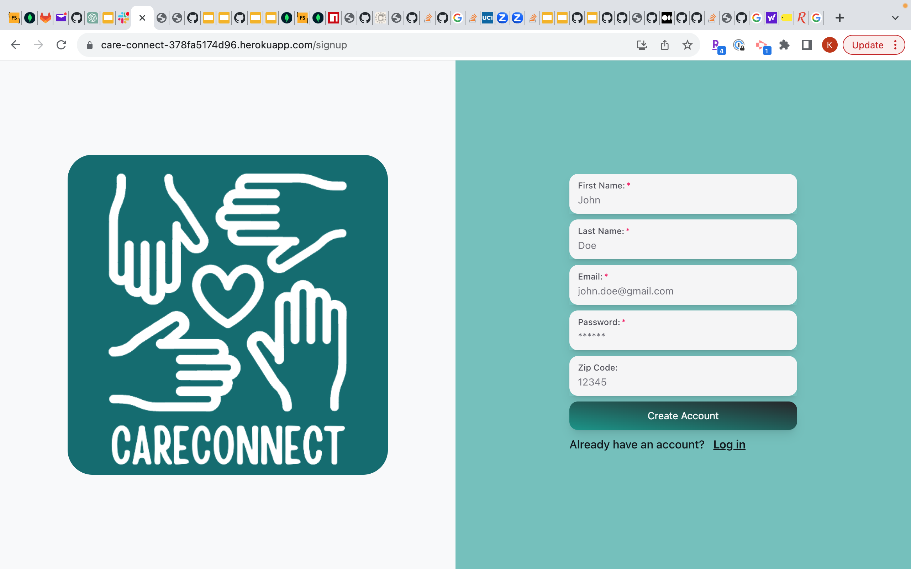
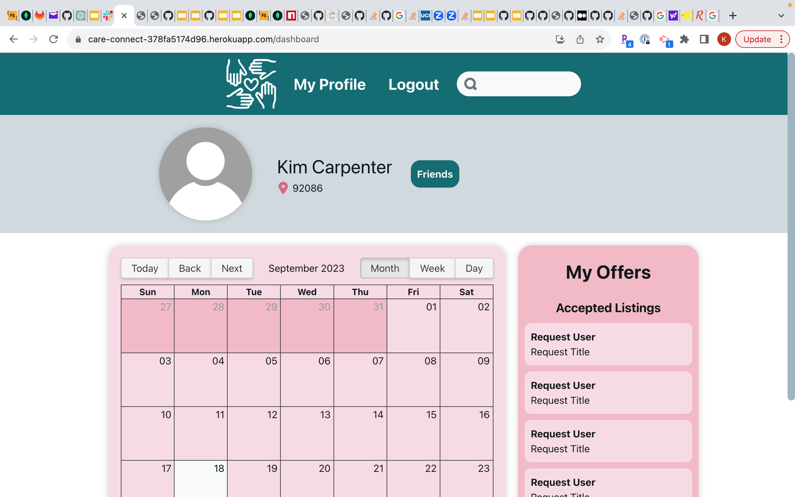
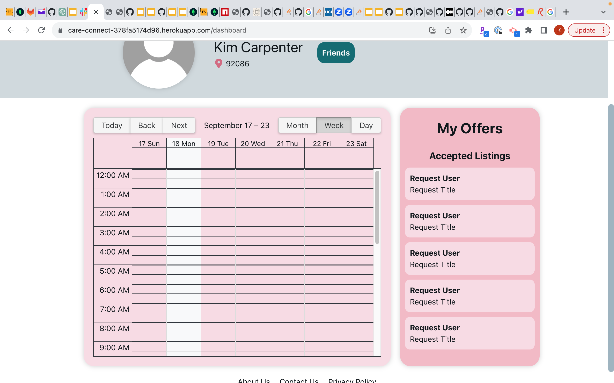
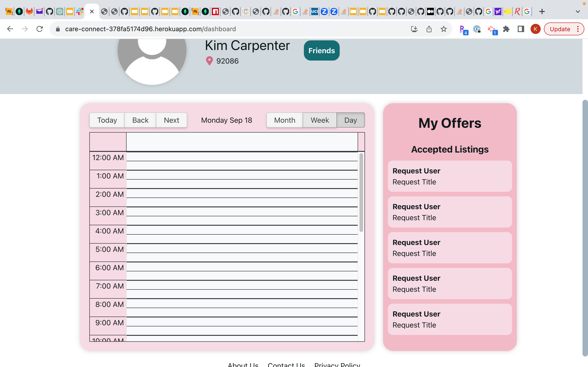

# CareConnect
Care Connect - Community Circle


## Live Demo

Check out the live demo of the app: [](https://care-connect-378fa5174d96.herokuapp.com/)
<br>
Presentation Slides: [](https://docs.google.com/presentation/d/1RjIZjl0G9_lSB3-7fKbuHJAO_isZM33KwT34OEkrZ9s/edit#slide=id.g27caa58f48d_3_959)
<br>
GitHub Repo: [](https://github.com/jenho-webdev/CareConnect)

# Tech Stack


## Description

CareConnect is a dedicated community-based application designed to bridge the gap between those who need assistance and those willing to offer a helping hand within their local community. Serving the sick, elderly, disabled, moms, and more, this platform empowers users to request specific help, whether it's a ride to a doctor's appointment, a meal, or tech assistance. By integrating shared calendar and posts features, CareConnect enhances the connection between community members. Allowing users to plan, volunteer, and coordinate assistance seamlessly.

- What was your motivation? The motivation behind creating CareConnect a community-based application is driven by a desire to build stronger and more supportive local communities. This platform aims to leverage technology to facilitate connections between individuals who can provide assistance and those who require it.

- Why did you build this project? To foster a sense of community and neighborly support in an increasingly digital and disconnected world. To empower individuals to seek and offer help, encouraging a culture of mutual assistance and kindness. To provide a platform that makes it easier for people, especially those with specific needs like the sick, elderly, or disabled, to access the help and services they require.
  
- What problem does it solve? Many individuals, especially seniors and people with disabilities, can experience social isolation. CareConnect helps combat this by connecting them with volunteers and support within their community. Sometimes, individuals struggle to access necessary services, such as transportation to medical appointments or assistance with daily tasks. CareConnect fills this gap by facilitating connections between those in need and willing helpers. The project encourages community members to actively engage with and support one another, fostering a sense of belonging and unity.Caregivers, volunteers, and those needing assistance can use the calendar and posts to feature coordinated tasks and stay organized, ensuring that help is provided effectively.
  
- What did you learn? Projects like CareConnect are motivated by a desire to strengthen communities, empower individuals, and address specific challenges related to accessibility and support. Through these initiatives, valuable insights are gained about community dynamics, user-centered design, and the power of technology to facilitate local connections and assistance.
  
## User Story
```
AS a member of the Care Connect Community Circle, 
I WANT to use the app to connect with fellow caregivers and individuals in similar caregiving situations 
SO THAT they can share experiences, exchange advice, and offer support.
```

## Requirements
```
Use React for the front end.
Use GraphQL with a Node.js and Express.js server.
Use MongoDB and the Mongoose ODM for the database.
Use queries and mutations for retrieving, adding, updating, and deleting data.
Be deployed using Heroku (with data).
Have a polished UI.
Be responsive.
Be interactive (i.e., accept and respond to user input).
Include authentication (JWT).
Protect sensitive API key information on the server.
Have a clean repository that meets quality coding standards (file structure, naming conventions, best practices for class and id naming conventions, indentation, high-quality comments, and so on).
Have a professional README (with unique name, description, technologies used, screenshot, and link to deployed application).
```

## Table of Contents

- [CareConnect](#careconnect)
  - [Live Demo](#live-demo)
- [Tech Stack](#tech-stack)
  - [Description](#description)
  - [User Story](#user-story)
  - [Requirements](#requirements)
  - [Table of Contents](#table-of-contents)
  - [Wireframes](#wireframes)
  - [Screen Shots](#screen-shots)
  - [Colaborators](#colaborators)
  - [Sources](#sources)
  - [Key Features](#key-features)

## Wireframes








## Screen Shots








## Colaborators

Contributor Profiles:
[](https://github.com/cwchilvers)
[](https://github.com/saduhub)
[](https://github.com/jenho-webdev)
[](https://github.com/Kimberlyc1904)
[](https://github.com/jedichang99)

## Sources
```
ChatGPT
W3 Schools
Google
Stack Overflow
Apollo Docs
```

## Key Features

- **Request Assistance:** Users can request specific types of help, such as rides, meal deliveries, or tech support.
- **Offer Assistance:** Individuals can volunteer their time and skills to assist others in their community.
- **Shared Calendar:** A shared calendar enables users to coordinate tasks and appointments efficiently.
- **Community Posts:** Users can engage in discussions, share resources, and connect with others through community posts.
- **Privacy and Security:** CareConnect prioritizes user privacy and data security.
